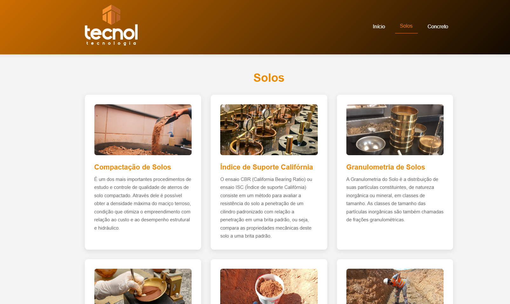
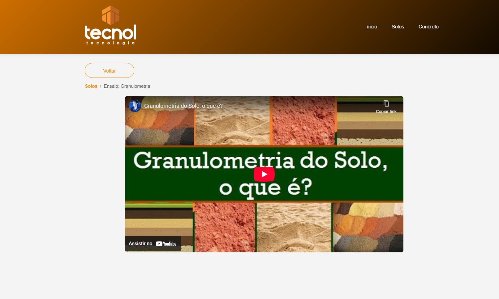

# 📚 TECNOL - Colaborador

> Plataforma educacional para ensaios e informações sobre Solos e Concreto.

---

## 🎯 Sobre o Projeto

Site educacional desenvolvido para fornecer informações e ensaios sobre:

- **Solos** - Compactação, CBR e outros ensaios
- **Concreto** - Propriedades e aplicações
- Vídeos explicativos

---

## 📸 Screenshots

### Tela Inicial

### Seção de Solos

### Tela de Vídeo

---

## 🛠️ Tecnologias Utilizadas

- **HTML5** - Estrutura semântica
- **CSS3** - Estilização e animações
- **JavaScript** - Interatividade e lógica
- **YouTube API** - Integração de vídeos

---

## 📱 Seções Disponíveis

### 1️⃣ Início (Home)

- Mensagem de boas-vindas
- Animação de bolinhas bounce
- Introdução ao site

### 2️⃣ Solos

- **Compactação de Solos** - Ensaio de compactação
- **Índice de Suporte Califórnia (CBR)** - Resistência do solo
- **Granulometria** - O estudo da distribuição dos tamanhos das partículas minerais (areia, silte, argila, pedregulho)
- **Limites de Atterberg** - Parâmetro que define a consistência dos solos argilosos conforme o teor de água, composto pelos limites de liquidez, plasticidade e contração.
- **Determinação da massa específica aparente, in situ** - Realizado para verificar se a compactação do solo em campo foi eficaz.
- **Compacidade relativa de solos não coesivos** - Índice utilizado para determinar o grau de compactação de um material granular, não coesivo, como as areias.

### 3️⃣ Concreto

- **Resistência à Compressão do Concreto** - Mede sua capacidade de suportar pressão, expressa em Megapascals (MPa)
- **Abatimento (Slump Test)** - É um ensaio de consistência do concreto fresco que mede sua trabalhabilidade e fluidez usando um molde em forma de tronco de cone.
- **Recebimento de concreto usinado na obra** - Verificação da nota fiscal (horário, volume, traço), teste de abatimento (slump test) para consistência, e moldagem de corpos de prova para resistência futura, além de aplicação rápida (em até 2h30) e cura adequada para garantir a qualidade.

### 4️⃣ Reprodutor de Vídeo

- Breadcrumb de navegação
- Reprodutor responsivo
- Botão voltar para categorias

## 💻 Recursos Responsivos

- ✅ Desktop (>1024px)
- ✅ Tablet (768px - 1024px)
- ✅ Mobile (<768px)

---

## 📄 Licença

Este projeto é para fins educacionais.

---

**Última atualização:** Janeiro de 2026

**Desenvolvido para educação po Eduardo Oliveira**
